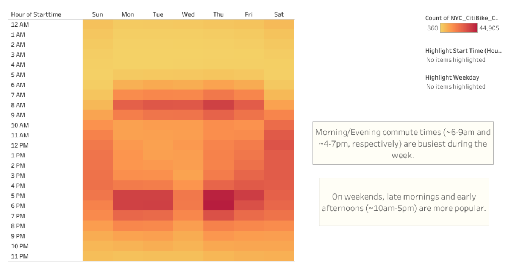
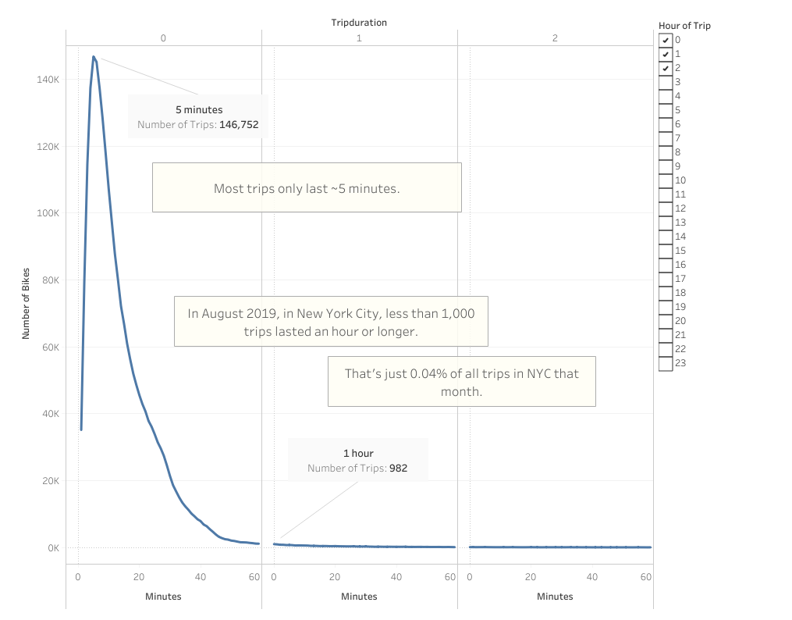
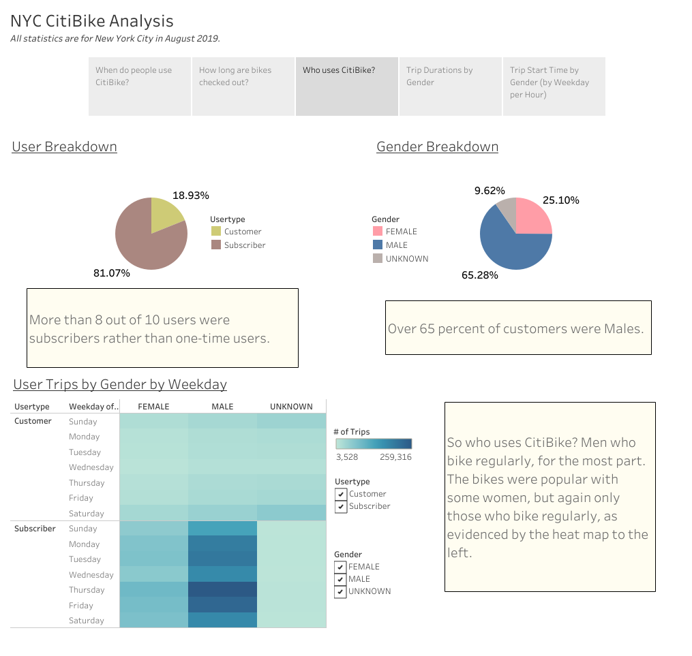
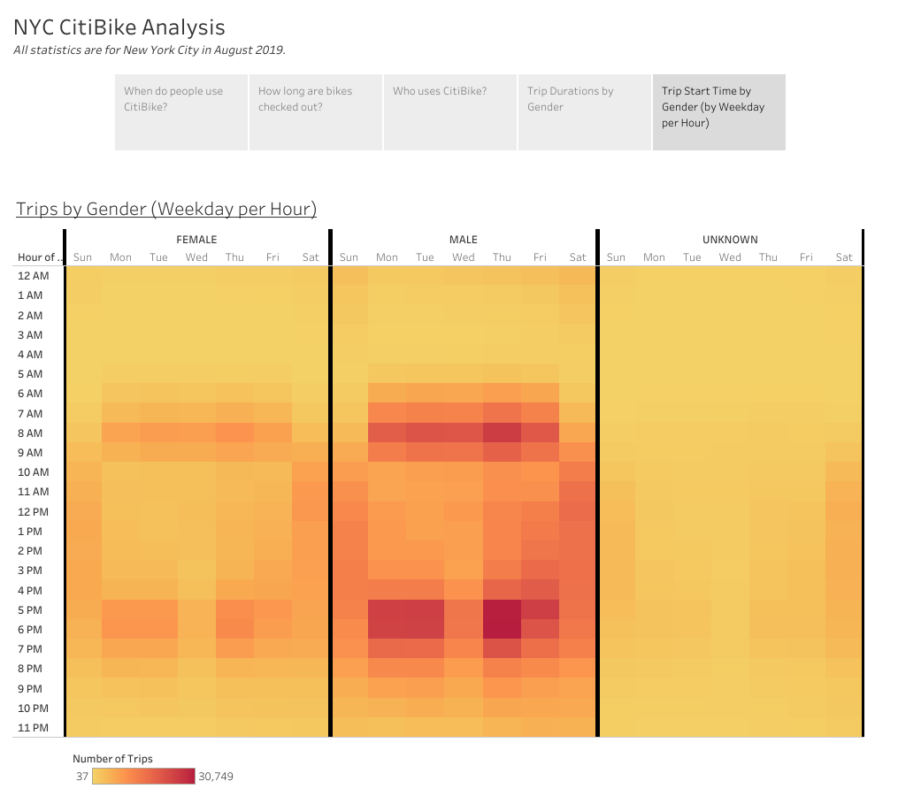
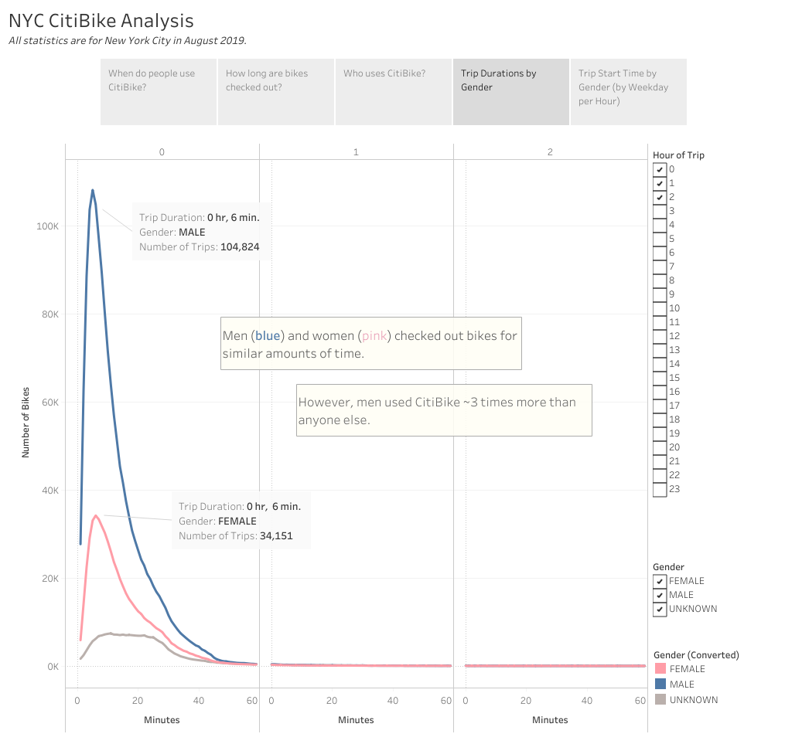

# Bikesharing
Visualizing bike-sharing data with Tableau.

## Overview
Analyzing New York City bike-sharing data from August 2019, and evaluating the plausibility of a similar bike-sharing service in Des Moines, Iowa.
#### Resources:
* 201908-citibike-tripdata.csv
* NYC_CitiBike_Challenge.csv
  

## Results
[View Story on Tableau Public](https://public.tableau.com/views/NYC_Bikesharing_Challenge/NYCCitiBikeAnalysis?:language=en-US&publish=yes&:display_count=n&:origin=viz_share_link)

### Popular Ride Times

### Trip Durations

These first two charts give us insight into why people are using CitiBike. They aren't perfect as they don't spell it out for us, but they both seem to point toward commuting and weekend leisure.  
The first chart is a heatmap highlighting the most popular times for CitiBike rides, usually during morning and evening rush hour. The second chart tells us how many rides there were for every possible trip duration (in minutes). We know then that most bikes are used during the morning/evening rush for about 3-8 minutes, which in New York City, probably gets you close to your destination. We also know that on weekends bikes are mostly used during the day. Users are likely running errands and want to get around quickly without the hassle of the subway or a cab. But who are these users?

### Who uses CitiBike?

With more than 80% of business coming from subscribers, the service seems most popular with those who use CitiBike regularly, which is promising. This means business is regular and stable rather than sporadic. It is certainly a product of the demographic, as urban commuters foster high demand for public transport, but it also indicates CitiBike is of a high enough quality and reliability to retain a large portion of its customers, which is important in any venture.

Additionally, over 65% of users are male - most of whom are subscribers as well. Let's expand on this...
  

### Popular Ride Times by Gender

### Trip Durations by Gender

The visualizations above are nearly identical to the first two, as the patterns are the same in both sets of images. All three heat maps here are the same as the first, and this line chart looks like the earlier one as well. Clearly the only difference is the division of each chart by gender, which has magnified the weight each carries in the overall data charts we saw before.  
We can figure out that everyone is using the bikes around the same times, and for the same amounts of time, regardless of gender. That said, men are using the bikes the most frequently. There is some popularity with women as well, but based on the Trip Durations by Gender chart, males are using the service nearly three times more than anyone else.  
What does this mean for Des Moines? Well, it could mean that CitiBike is most popular with men who are looking to stay fit and get around town easily. Based on the data there are women who fall into this category as well, just fewer of them. In that case, Des Moines should market the bikes to these commuters, who are probably nimble young people, but still promote their use among other demographics. Sure, the bikes are mostly used in the mornings and evenings in New York, but people work during the day, there will always be less people on the road (or sidewalk). The service can be used for a number of reasons, including shopping, travelling, exercise, etc., and I think the all-day popularity of the bikes among all genders on Saturday and Sunday, and even Friday, should prove it.

  

## Summary
In short, the service can be marketed in a variety of ways, from a fit- and environmentally-friendly way to commute, to cheap and readily available public transport, or even as a weekend leisure activity. Its versatility allowing it to appeal to a number of demographics along with its ability to retain customers make it difficult to find a way it could fail.  
Obviously Des Moines is less populous than New York City, and by no small margin, but it is still a highly populated area with an untapped customer base. The numbers may be smaller than New York's, but there is no evidence the proportions should vary by much. The appeal is the same, there are just less people.  
That said, more research could help us further understand CitiBike's success in New York City, and to assess its prospects in Des Moines more accurately. More user data could tell us which age groups it is most popular with, distance travelled, trip duration by weekday by hour, etc. While it is hard to doubt CitiBike's plausibility in any city, such data would provide a tremendous advantage in marketing and deployment, giving it a greater chance of success in Des Moines.