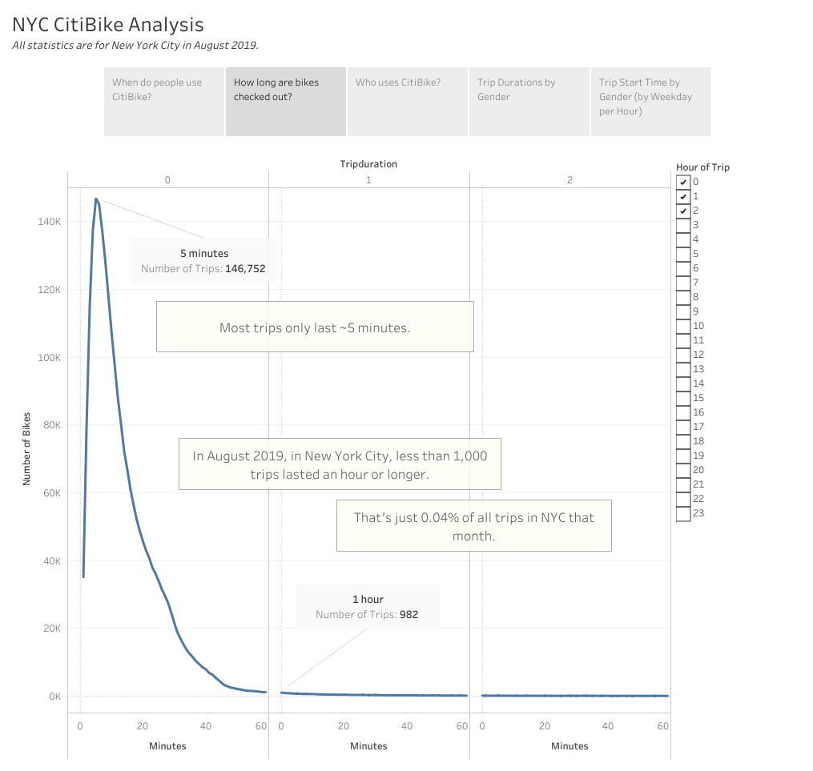
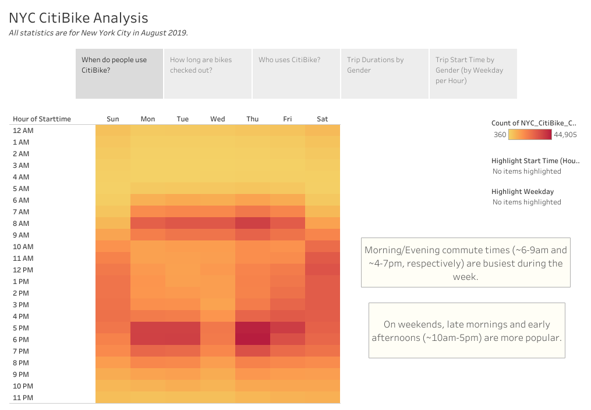

# Bikesharing
Visualizing bike-sharing data with Tableau.

## Overview
Analyzing New York City bike-sharing data from August 2019, and evaluating the plausibility of a similar bike-sharing service in Des Moines, Iowa.
#### Resources:
* 201908-citibike-tripdata.csv
* NYC_CitiBike_Challenge.csv
  

## Results
[View Story on Tableau Public](https://public.tableau.com/views/NYC_Bikesharing_Challenge/NYCCitiBikeAnalysis?:language=en-US&publish=yes&:display_count=n&:origin=viz_share_link)

Trip Durations                               | Trip Start Times
:-------------------------------------------:|:------------------------------------:
 | 

Trip Durations by Gender                     | Trip Start Times by Gender
:-------------------------------------------:|:------------------------------------:
 | 

  

## Summary
The service can be marketed in a variety of ways, from a fit- and environmentally-friendly way to commute, to cheap and readily available public transport, or even as a weekend leisure activity. 